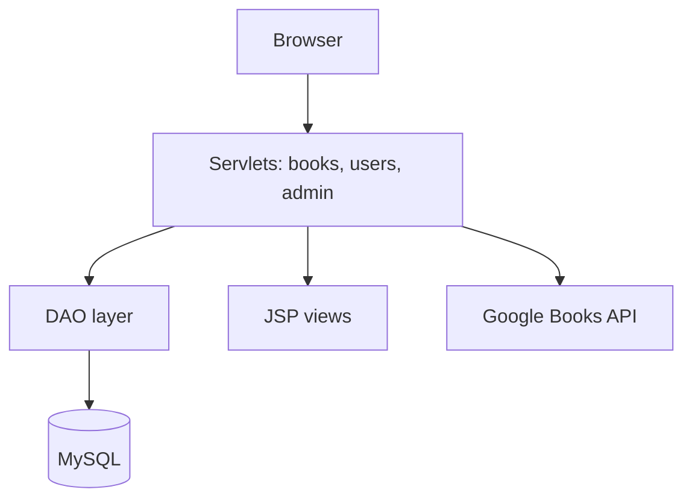

# EBook — Java Servlet/JSP App

A Maven-based web app for managing books, users, comments, carts, and admin features using Servlets/JSP, JSTL, and MySQL. It also integrates Google Books search.

## Features

- Book CRUD, listing, and details with comments.
- User registration, login, logout, and admin management.
- Cart operations and per-user listings.
- Google Books search integration.

## Tech Stack

- Java 11, Servlet API 5.0, JSTL 1.2, JUnit 5, MySQL Connector 8.0.29.
- Build: Maven (WAR packaging)
- Deploy: Any Servlet container (e.g., Tomcat)

## Architecture



## Clone and Run

### Clone

```bash
git clone <your-fork-or-repo-url> ebook
cd ebook
```

### Build

```bash
mvn clean package
```

### Configure

Set your database credentials via environment variables or a configuration file and update `DBConnect` to read them securely (avoid hardcoding credentials).

Example environment variables:

```bash
export DB_URL=jdbc:mysql://localhost:3306/ebook
export DB_USER=root
export DB_PASSWORD=yourpassword
```

### Deploy

1. Copy the WAR file to your servlet container:

```bash
cp target/EBook-1.0-SNAPSHOT.war <TOMCAT_HOME>/webapps/
```

2. Start the servlet container.
3. Open the app in your browser at:

```
http://localhost:8080/EBook-1.0-SNAPSHOT/
```

## Notes

* Review DAOs for proper resource handling.
* Consider using a connection pool (e.g., HikariCP) in production for better performance.
* Google Books API dependencies are included. Secure your API keys via configuration before use.
* Add unit tests under `src/test` for DAOs and key logic.

## Contributing

1. Fork the repository.
2. Create a new branch for your feature or bugfix.
3. Commit changes with meaningful messages.
4. Push to your fork and create a pull request.

